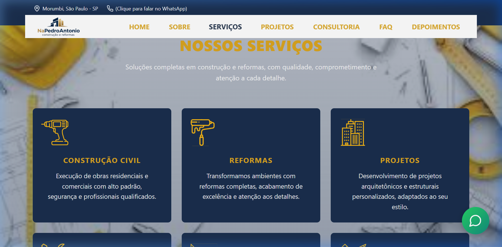
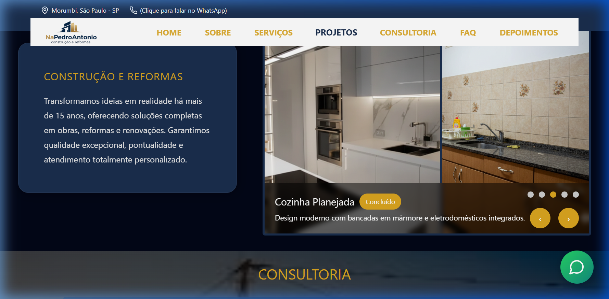
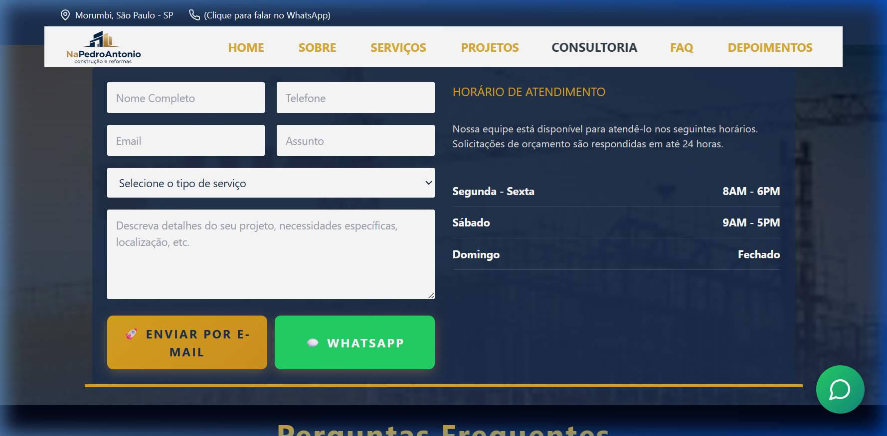

# NPA - Construção e Reformas 🏠🏗️

Landing Page profissional de alta conversão para a **NPA — Construção e Reformas**, especializada em reformas residenciais e comerciais de alto padrão em São Paulo (Morumbi e região).

[**🚀 Ver Site ao Vivo**](https://landing-page-for-napedroantonio.vercel.app/)

---

## 📸 Screenshots

### Visão Geral (Hero)

*Design premium com foco em autoridade e conversão imediata.*

### Serviços Especializados

*Exibição clara das competências: Construção, Reforma, Consultoria e Projetos.*

### Portfólio Interativo (Antes & Depois)

*Slider interativo para visualização de transformações reais.*

### Atendimento e FAQ

*Fluxo de captura de leads via E-mail (Web3Forms) e WhatsApp corporativo.*

---

## ✨ Funcionalidades Principais

- **🚀 Performance Extrema:** Construído com Vite + React para carregamento instantâneo.
- **📱 Mobile First:** Experiência otimizada e navegação fluida em smartphones.
- **✉️ Web3Forms Integration:** Envio de orçamentos diretamente para o e-mail da empresa sem backend.
- **💬 WhatsApp Híbrido:** Botões de ação rápida para contato humano imediato.
- **🔍 SEO & Marketing:** Meta tags configuradas para Google Ads e compartilhamento em redes sociais.
- **📊 GTM Ready:** Estrutura pronta para Google Tag Manager e Analytics.

## 🛠️ Tecnologias Utilizadas

- **Core:** [React 18](https://reactjs.org/) + [TypeScript](https://www.typescriptlang.org/)
- **Build Tool:** [Vite](https://vitejs.dev/)
- **Styling:** [Styled Components](https://styled-components.com/) + [Vanilla CSS](https://developer.mozilla.org/en-US/docs/Web/CSS)
- **Animations:** [Framer Motion](https://www.framer.com/motion/)
- **Icons:** [Lucide React](https://lucide.dev/) + [React Icons](https://react-icons.github.io/react-icons/)
- **Form:** [Web3Forms API](https://web3forms.com/)
- **Deploy:** [Vercel](https://vercel.com/)

## ⚙️ Configuração Local

1. Clone o repositório:
   ```bash
   git clone https://github.com/uchoacarlos22/landing_page_for_napedroantonio.git
   ```
2. Instale as dependências:
   ```bash
   npm install
   ```
3. Inicie o servidor de desenvolvimento:
   ```bash
   npm run dev
   ```

## 📄 Licença

Este projeto foi desenvolvido para a **NPA — Construção e Reformas**. Todos os direitos reservados.

---
Desenvolvido com ❤️ por Antigravity.